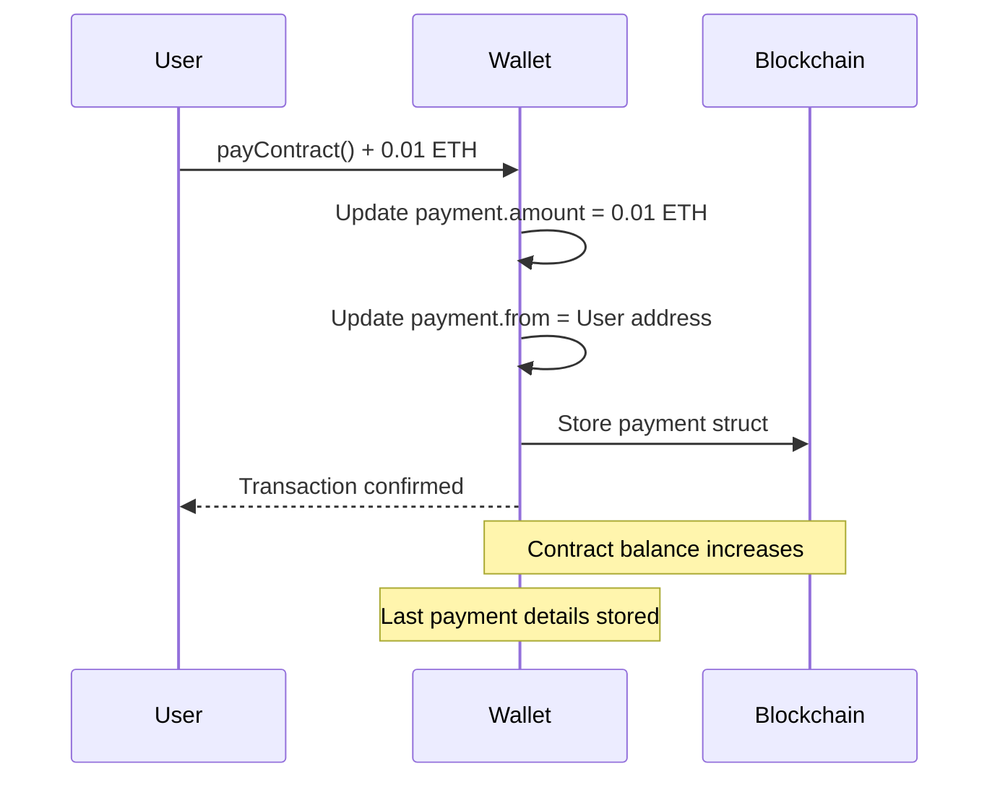
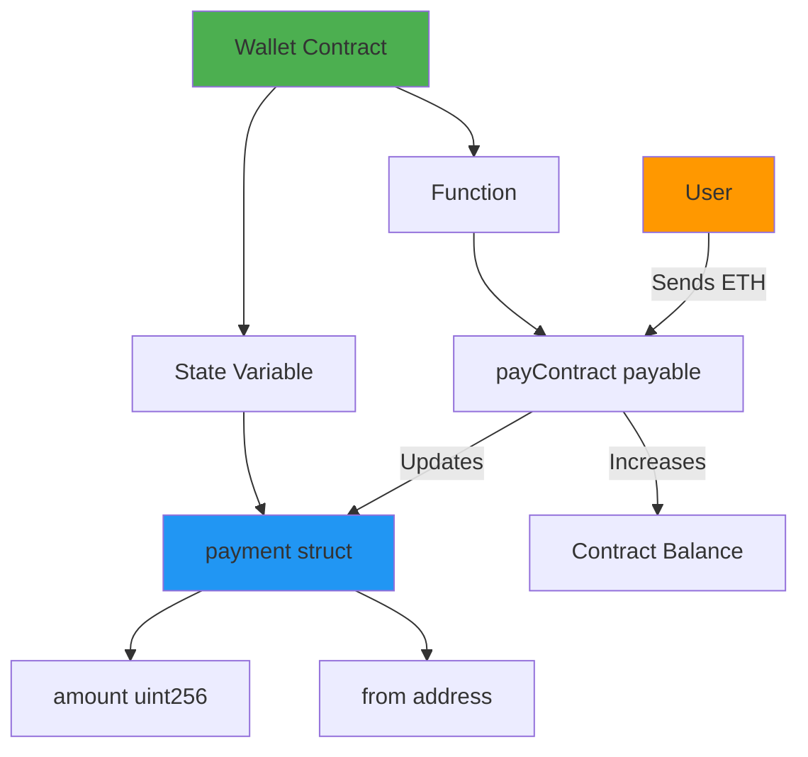
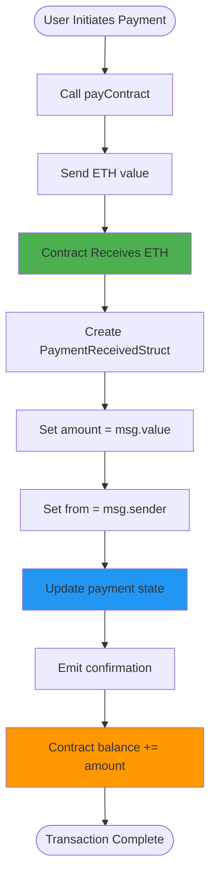
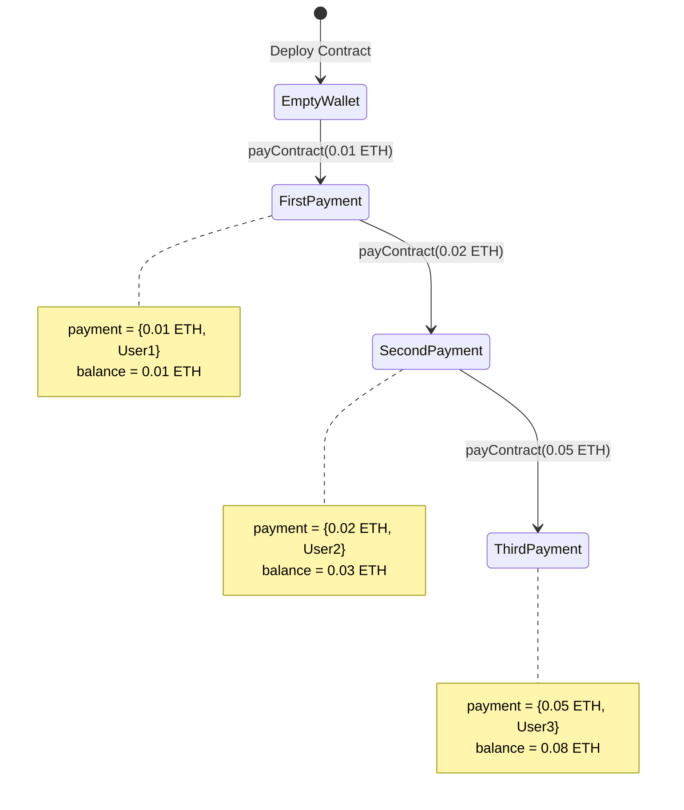

# Simple Wallet Smart Contract

<div align="center">
  <a href="https://docs.soliditylang.org/en/v0.8.20/"></a>
  <a href="https://hardhat.org/"></a>
  <a href="https://opensource.org/licenses/MIT"></a>
  <a href="https://hardhat.org/hardhat-network/docs"></a>
  <a href="https://ethereum.org/"></a>
</div>

<div align="center">
  <h3>A simple wallet contract that receives and tracks ETH payments</h3>
  <p>Learn smart contract basics with payment receiving and struct data storage</p>
  
  <br>
  
  <a href="#overview">Overview</a> • 
  <a href="#features">Features</a> •
  <a href="#getting-started">Getting Started</a> •
  <a href="#deployment">Deployment</a> •
  <a href="#usage-examples">Usage</a> •
  <a href="#how-it-works">How It Works</a> •
  <a href="#author">Author</a>
  
  <br><br>
  
  
  
  
</div>

---

## Table of Contents

- [Overview](#overview)
- [Features](#features)
- [How It Works](#how-it-works)
- [Architecture](#architecture)
- [Workflow](#workflow)
- [Getting Started](#getting-started)
- [Contract Details](#contract-details)
- [Deployment](#deployment)
- [Usage Examples](#usage-examples)
- [Use Cases](#use-cases)
- [Author](#author)

---

## Overview

The Simple Wallet contract demonstrates fundamental smart contract concepts including receiving ETH payments, storing data in structs, and maintaining state. Perfect for beginners learning Solidity or as a foundation for more complex payment systems.

### Key Highlights

- **Receive ETH**: Accept payments from any address
- **Track Payments**: Store last payment details
- **Struct Usage**: Demonstrates struct data structure
- **State Management**: Maintains payment information
- **Simple & Clean**: Minimal code for learning
- **Gas Efficient**: Optimized for low gas costs

---

## Features

| Feature | Description |
|---------|-------------|
| **ETH Payments** | Accept ETH from any address |
| **Payment Tracking** | Store amount and sender address |
| **Struct Storage** | Demonstrate struct data type |
| **Public Getter** | Automatic getter for payment data |
| **Payable Function** | Receive value in transactions |
| **State Updates** | Update payment record on each call |

---

## How It Works

### Payment Flow

<div align="center">



</div>

### Data Storage

When a payment is received:
1. Amount (in wei) is stored
2. Sender address is recorded
3. Previous payment data is overwritten
4. Contract balance increases

**Example:**
```
Before: payment = {amount: 0, from: 0x0}
Call payContract() with 0.01 ETH from 0xABC...
After: payment = {amount: 10000000000000000, from: 0xABC...}
```

---

## Architecture

<div align="center">



</div>

### Contract Structure

```
Wallet
├── Struct
│   └── PaymentReceivedStruct
│       ├── amount (uint256)
│       └── from (address)
├── State Variable
│   └── payment (PaymentReceivedStruct)
└── Function
    └── payContract() payable
```

---

## Workflow

### Complete Payment Process

<div align="center">



</div>

### State Changes

<div align="center">



</div>

---

## Getting Started

### Prerequisites

- Node.js v16+
- npm or yarn
- Git
- Hardhat
- ETH for transactions

### Installation

```bash
# Clone repository
git clone https://github.com/Siddheshwar-cloud/SimpleWallet.git
cd SimpleWallet

# Install dependencies
npm install
```

### Project Structure

```
SimpleWallet/
├── contracts/
│   └── wallet.sol
├── scripts/
│   ├── deploy.js
│   └── interact.js
├── hardhat.config.js
└── README.md
```

---

## Contract Details

### Struct Definition

```solidity
struct PaymentReceivedStruct {
    uint256 amount;    // Amount in wei
    address from;      // Sender address
}
```

**Purpose:** Group related payment data together

---

### State Variable

```solidity
PaymentReceivedStruct public payment;
```

**Visibility:** Public (automatic getter generated)

**Storage:** Stored in contract storage

---

### Function

#### payContract()

```solidity
function payContract() public payable
```

Receives ETH and updates payment record.

**Visibility:** Public (anyone can call)

**Modifier:** Payable (can receive ETH)

**Parameters:** None

**Effects:**
- Updates `payment.amount` with `msg.value`
- Updates `payment.from` with `msg.sender`
- Increases contract balance

**Example:**
```javascript
await wallet.payContract({ value: ethers.parseEther("0.01") });
```

---

### Automatic Getter

Since `payment` is public, Solidity automatically creates:

```solidity
function payment() public view returns (uint256 amount, address from)
```

**Usage:**
```javascript
const paymentData = await wallet.payment();
console.log("Amount:", paymentData.amount);
console.log("From:", paymentData.from);
```

---

## Deployment

### Deploy New Contract

```bash
# Create deploy script (scripts/deploy.js)
npx hardhat run scripts/deploy.js --network localhost
```

**Deploy Script:**

```javascript
const hre = require("hardhat");

async function main() {
  const Wallet = await hre.ethers.getContractFactory("wallet");
  const wallet = await Wallet.deploy();
  await wallet.waitForDeployment();
  
  console.log("Wallet deployed to:", await wallet.getAddress());
}

main();
```

---

## Usage Examples

### Send Payment to Contract

```javascript
const hre = require("hardhat");

async function main() {
  const CONTRACT_ADDRESS = "0xYourContractAddress";
  
  const wallet = await hre.ethers.getContractAt("wallet", CONTRACT_ADDRESS);
  
  // Send 0.01 ETH
  const tx = await wallet.payContract({
    value: hre.ethers.parseEther("0.01")
  });
  
  console.log("Transaction hash:", tx.hash);
  await tx.wait();
  console.log("Payment successful!");
}

main();
```

---

### Check Payment Details

```javascript
async function checkPayment() {
  const wallet = await hre.ethers.getContractAt("wallet", CONTRACT_ADDRESS);
  
  const payment = await wallet.payment();
  
  console.log("=== Last Payment ===");
  console.log("Amount:", hre.ethers.formatEther(payment.amount), "ETH");
  console.log("From:", payment.from);
}

checkPayment();
```

---

### Check Contract Balance

```javascript
async function checkBalance() {
  const CONTRACT_ADDRESS = "0xYourContractAddress";
  
  const balance = await hre.ethers.provider.getBalance(CONTRACT_ADDRESS);
  
  console.log("Contract Balance:", hre.ethers.formatEther(balance), "ETH");
}

checkBalance();
```

---

### Complete Interaction Example

```javascript
const hre = require("hardhat");

async function main() {
  const [sender1, sender2] = await hre.ethers.getSigners();
  
  // Deploy contract
  const Wallet = await hre.ethers.getContractFactory("wallet");
  const wallet = await Wallet.deploy();
  await wallet.waitForDeployment();
  
  const address = await wallet.getAddress();
  console.log("Wallet deployed:", address);
  
  // First payment
  console.log("\n--- First Payment ---");
  await wallet.connect(sender1).payContract({
    value: hre.ethers.parseEther("0.5")
  });
  
  let payment = await wallet.payment();
  let balance = await hre.ethers.provider.getBalance(address);
  
  console.log("Amount:", hre.ethers.formatEther(payment.amount), "ETH");
  console.log("From:", payment.from);
  console.log("Balance:", hre.ethers.formatEther(balance), "ETH");
  
  // Second payment
  console.log("\n--- Second Payment ---");
  await wallet.connect(sender2).payContract({
    value: hre.ethers.parseEther("1.2")
  });
  
  payment = await wallet.payment();
  balance = await hre.ethers.provider.getBalance(address);
  
  console.log("Amount:", hre.ethers.formatEther(payment.amount), "ETH");
  console.log("From:", payment.from);
  console.log("Balance:", hre.ethers.formatEther(balance), "ETH");
}

main();
```

---

### Multiple Payments Tracking

```javascript
async function trackMultiplePayments() {
  const wallet = await hre.ethers.getContractAt("wallet", CONTRACT_ADDRESS);
  const [user1, user2, user3] = await hre.ethers.getSigners();
  
  const payments = [
    { user: user1, amount: "0.1" },
    { user: user2, amount: "0.25" },
    { user: user3, amount: "0.5" }
  ];
  
  console.log("=== Sending Payments ===\n");
  
  for (const pay of payments) {
    await wallet.connect(pay.user).payContract({
      value: hre.ethers.parseEther(pay.amount)
    });
    
    const payment = await wallet.payment();
    const balance = await hre.ethers.provider.getBalance(await wallet.getAddress());
    
    console.log(`Payment from ${pay.user.address}:`);
    console.log(`  Amount: ${pay.amount} ETH`);
    console.log(`  Contract Balance: ${hre.ethers.formatEther(balance)} ETH\n`);
  }
}

trackMultiplePayments();
```

---

### Monitor Payments

```javascript
async function monitorPayments() {
  const wallet = await hre.ethers.getContractAt("wallet", CONTRACT_ADDRESS);
  
  console.log("Monitoring wallet...\n");
  
  // Check every 10 seconds
  setInterval(async () => {
    const payment = await wallet.payment();
    const balance = await hre.ethers.provider.getBalance(await wallet.getAddress());
    
    console.log("--- Current Status ---");
    console.log("Last Payment:", hre.ethers.formatEther(payment.amount), "ETH");
    console.log("Last Sender:", payment.from);
    console.log("Total Balance:", hre.ethers.formatEther(balance), "ETH\n");
  }, 10000);
}

monitorPayments();
```

---

## Use Cases

### 1. Learning Tool

Perfect for understanding:
- Payable functions
- Struct data types
- State variables
- ETH handling

---

### 2. Donation Contract

Accept donations and track last donor.

```javascript
// Simple donation
await wallet.payContract({ value: ethers.parseEther("0.1") });
```

---

### 3. Payment Prototype

Foundation for more complex payment systems.

**Can be extended with:**
- Payment history array
- Event emissions
- Withdrawal functions
- Access controls

---

### 4. Testing Platform

Test ETH transactions in development environment.

```javascript
// Test different payment amounts
const amounts = ["0.01", "0.05", "0.1", "0.5"];
for (const amt of amounts) {
  await wallet.payContract({ value: ethers.parseEther(amt) });
}
```

---

### 5. Contract Funding

Basic mechanism to fund a contract.

```javascript
// Fund contract for operations
await wallet.payContract({ value: ethers.parseEther("10") });
```

---

## Important Notes

### Current Limitations

1. **Overwrites Data**: Each payment overwrites previous payment info
2. **No History**: Doesn't store payment history
3. **No Withdrawal**: No function to retrieve stored ETH
4. **No Events**: Doesn't emit events for payments
5. **No Access Control**: Anyone can call payContract

### Potential Enhancements

```solidity
// Add payment history
PaymentReceivedStruct[] public paymentHistory;

// Add events
event PaymentReceived(address indexed from, uint256 amount);

// Add withdrawal
function withdraw(uint256 amount) public onlyOwner {
    // withdrawal logic
}
```

---

## Understanding Key Concepts

### Payable Modifier

```solidity
function payContract() public payable
```

**Allows:** Function to receive ETH

**Without payable:** Transaction would revert when sending ETH

---

### msg.value

```solidity
payment.amount = msg.value;
```

**Returns:** Amount of wei sent with transaction

**Example:** Sending 0.01 ETH = 10000000000000000 wei

---

### msg.sender

```solidity
payment.from = msg.sender;
```

**Returns:** Address that called the function

**Type:** address

---

### Wei Conversion

```
1 ETH = 1,000,000,000,000,000,000 wei (10^18)
0.01 ETH = 10,000,000,000,000,000 wei
0.001 ETH = 1,000,000,000,000,000 wei
```

---

## Testing

### Hardhat Console Testing

```bash
npx hardhat console --network localhost
```

```javascript
// Get contract
const Wallet = await ethers.getContractFactory("wallet");
const wallet = await Wallet.attach("CONTRACT_ADDRESS");

// Send payment
await wallet.payContract({ value: ethers.parseEther("0.01") });

// Check payment
const payment = await wallet.payment();
console.log(payment);

// Check balance
const balance = await ethers.provider.getBalance(await wallet.getAddress());
console.log(ethers.formatEther(balance));
```

---

## Security Considerations

### Current Implementation

- ✅ Simple and predictable
- ✅ No external calls
- ✅ No access to stored funds (no withdrawal)
- ⚠️ Anyone can update payment data
- ⚠️ No way to retrieve stored ETH

### For Production Use

Consider adding:
1. **Withdrawal mechanism** for stored ETH
2. **Access control** for sensitive functions
3. **Event emissions** for tracking
4. **Payment history** array
5. **Reentrancy guards** if adding withdrawals

---

## FAQ

**Q: Can I retrieve sent ETH?**
A: Not with current contract. Need to add withdrawal function.

**Q: Why only last payment stored?**
A: Struct overwrites on each call. Use array for history.

**Q: Can anyone send ETH?**
A: Yes, function is public and payable.

**Q: Is ETH locked forever?**
A: In current version, yes. Contract needs withdrawal function.

**Q: What's the gas cost?**
A: Minimal - just storage update (2 SSTOREs).

**Q: Can I send 0 ETH?**
A: Yes, but not recommended. Add require check.

---

## Technology Stack

| Technology | Version | Purpose |
|------------|---------|---------|
| Solidity | ^0.8.20 | Contract language |
| Hardhat | Latest | Development |
| Ethers.js | v6 | Interactions |
| Node.js | v16+ | Runtime |

---

## Author

<div align="center">
  
  
  
  
</div>

<br>

<div align="center">
  
</div>

<br>

<table align="center">
  <tr>
    <td align="center" width="200">
      
      <br><strong>GitHub</strong>
      <br><a href="https://github.com/Siddheshwar-cloud">@Siddheshwar-cloud</a>
    </td>
    <td align="center" width="200">
      
      <br><strong>LinkedIn</strong>
      <br><a href="https://www.linkedin.com/in/sidheshwar-yengudle-113882241/">Connect</a>
    </td>
    <td align="center" width="200">
      
      <br><strong>Twitter</strong>
      <br><a href="https://x.com/SYangudale">@SYangudale</a>
    </td>
  </tr>
</table>

<div align="center">
  
  <br>
  
  [](https://github.com/Siddheshwar-cloud)
  [](https://www.linkedin.com/in/sidheshwar-yengudle-113882241/)
  [](https://x.com/SYangudale)

</div>

<div align="center">

### Skills & Expertise


</div>

---

## Show Your Support

<div align="center">
  
[](https://github.com/Siddheshwar-cloud/SimpleWallet)

<a href="https://github.com/Siddheshwar-cloud/SimpleWallet/stargazers">
  
</a>

**Your star helps others learn smart contract development!**

</div>

<br>

### Repository Links

<div align="center">

[](https://github.com/Siddheshwar-cloud/SimpleWallet)
[](https://github.com/Siddheshwar-cloud/SimpleWallet/fork)
[](https://github.com/Siddheshwar-cloud/SimpleWallet/issues)
[](https://github.com/Siddheshwar-cloud/SimpleWallet/pulls)

</div>

---

## Buy Me A Coffee

<div align="center">

If this project helped you learn, consider supporting my work!

<br>

### Crypto Donations

**Solana Wallet:**
```
G9LUNsQfMgcRqWS2X9mcNf4kNhRWoxcZZri3p2ay7Yaf
```

<a href="https://solscan.io/account/G9LUNsQfMgcRqWS2X9mcNf4kNhRWoxcZZri3p2ay7Yaf">
  
</a>

<br><br>

### UPI Payment (India)

**UPI ID:** `shidheshoryangudale-2@okicici`

<br>

<a href="upi://pay?pa=shidheshoryangudale-2@okicici&pn=Sidheshwar%20Yengudle&cu=INR">
  
</a>

<br><br>

**Every contribution is appreciated!** 🙏

</div>

---

## Contributing

Ideas for enhancements:
- Add payment history array
- Implement event emissions
- Add withdrawal mechanism
- Create access controls
- Build frontend interface

---

## License

MIT License

```
Copyright (c) 2026 Sidheshwar Yengudle
```

---

<div align="center">
  <p>Made with dedication to blockchain education</p>
  
  <br>
  
  <a href="https://github.com/Siddheshwar-cloud/SimpleWallet#simple-wallet-smart-contract">
    
  </a>
  <a href="https://github.com/Siddheshwar-cloud/SimpleWallet#how-it-works">
    
  </a>
  <a href="https://github.com/Siddheshwar-cloud/SimpleWallet#use-cases">
    
  </a>
  
  <br><br>
  
  **Simple Code, Powerful Concepts!**
  
  <br>
  
  <a href="https://github.com/Siddheshwar-cloud/SimpleWallet#simple-wallet-smart-contract">
    
  </a>
  
  <br><br>
  
  Made with ❤️ and ☕ by Sidheshwar Yengudle © 2026
  
  <br><br>
  
  <a href="https://github.com/Siddheshwar-cloud">
    
  </a>
  
</div>
